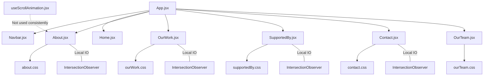

# PRE-REFACTOR.MD

## Current Architecture (Mermaid Diagram)

## Identified Flaws

1.  **Redundant Logic**: `OurWork`, `SupportedBy`, `Contact`, and `About` components each implement their own `IntersectionObserver` to trigger scroll animations.
2.  **CSS Duplication**: The `.scroll-fade` class and `flyInUp` keyframes are redefined in multiple CSS files (`about.css`, `contact.css`, `ourTeam.css`), leading to maintenance overhead.
3.  **Hook Inconsistency**: `src/utils/useScrollAnimation.jsx` exists but targets `.animate-on-scroll`, whereas components use `.scroll-fade`.
4.  **Navigation Fragility**: `Navbar.jsx` uses `window.location.href` for routing/scrolling, which triggers unnecessary page reloads.
5.  **Dead Code**: Numerous commented-out imports and variables in `OurWork.jsx` and `SupportedBy.jsx`.

## Refactor Blocks

### Block 1: Animation Globalization (Completed)
- **Files**: `src/styles/animations.css` (Created), `src/utils/useScrollAnimation.jsx` (Updated), `src/sections/*.jsx` (Updated), `src/styles/*.css` (Cleaned).
- **Goal**: Consolidate `.scroll-fade` into a global file and update the hook to be the single source of animation logic.

### Block 2: Component De-cluttering (Completed)
- **Files**: `src/sections/OurWork.jsx` (Cleaned), `src/sections/SupportedBy.jsx` (Cleaned), `src/components/Carousel.jsx` (Created).
- **Goal**: Remove dead code, commented-out imports, and abstract the carousel from `OurWork.jsx`.

### Block 3: Navigation & Routing (Completed)
- **Files**: `src/components/Navbar.jsx` (Updated), `src/utils/ScrollToHash.jsx` (Created), `src/App.jsx` (Updated).
- **Goal**: Replace `window.location.href` with a robust SPA-friendly scrolling mechanism using `react-router-dom`.
